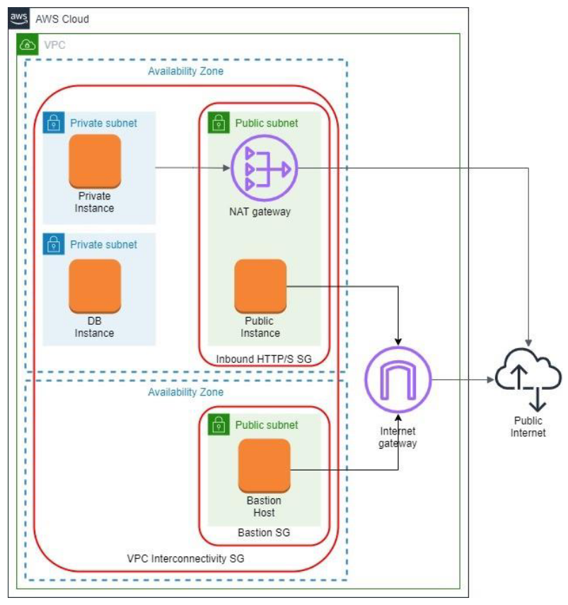

# VPC

Create a VPC which fulfills the following architecture (AWS diagram notation):

## Subtasks
1. The VPC should have a name following this convention `<ProjectName>-Network` and a CIDR block of `10.0.0.0/16.`
2. Create an internet gateway named `<ProjectName>-IGW` and attach it to the VPC.
3. Create two public subnets in the VPC:
    - `<ProjectName>-PublicSubnet-A` in the first AZ with a CIDR block of `10.0.11.0/24`.
    - `<ProjectName>-PublicSubnet-B` in the second AZ with a CIDR block of `10.0.21.0/24`.
    - Make them public and choose Auto-Assign Public IP.
    - Create a new route table named `<ProjectName>-PublicRouteTable`. Add a `10.0.0.0/16` – Local route and a route to the `<ProjectName>-IGW` to it.
    - Associate the subnets with the new route table.
4. Create private subnet in the VPC:
    - `<ProjectName>-PrivateSubnet-A` in the first AZ with a CIDR block of `10.0.12.0/24`.
    - Create new route table named `<ProjectName>-PrivateRouteTable-A`. Add a `10.0.0.0/16` – Local route to it.
    - Associate private subnet with the new route table.
5. Create DB subnet in the VPC:
    - `<ProjectName>-DbSubnet-A` in the first AZ with a CIDR block of `10.0.13.0/24`.
    - Create a new route table named `<ProjectName>-DbRouteTable`. Add a `10.0.0.0/16` – Local route to it.
    - Associate DB subnet with the new route table.
6. Create NAT gateway for the private subnet in public subnet:
    - `<ProjectName>-NatGateway-A` with an elastic IP for the subnet `<ProjectName>-PrivateSubnet-A`.
    - Add the gateway A the route table `<ProjectName>-PrivateRouteTable-A`.
7. Create a bastion host in the public subnet in the second AZ.
8. Create EC2 instance in the public subnet in the first AZ. Install the application developed in module 3 on the public instance.
9. Create one EC2 instance in the private subnet and one EC2 instance in the DB subnet. The instances do not have to have any special contents.
10. Create security groups:
    - To allow inbound SSH traffic only from your IP address. Apply security group to the bastion host.
    - To allow inbound HTTP/S traffic from anywhere. Apply security group to the public instance.
    - To allow all inbound traffic from other instances associated with this security group. The security group should specify itself as a source security group in its inbound rules. Apply security group to all the instances.

## Ensure:
- the application on the public instance is available from anywhere
- the private and DB instances are available from the bastion ONLY when you're connected to it over SSH (use the ping command or also ssh them)
- the bastion host and public instance have access to the Internet (ping Google, for example)
- the private instance has access to the Internet (ping Google, for example)
- the private and public instances have access to the DB instance (ping again)
- the DB instance doesn't have Internet access
