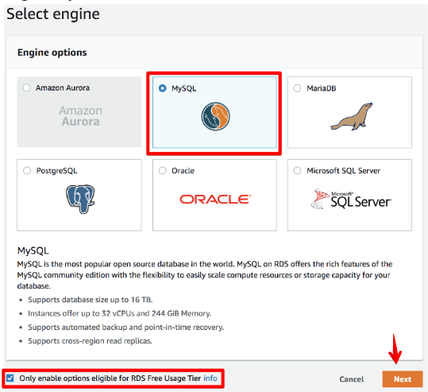
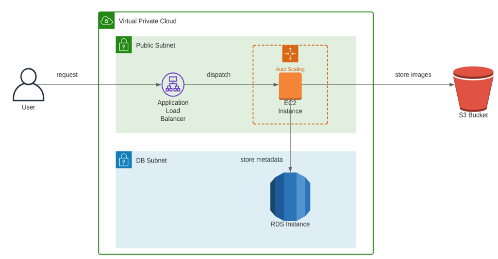

# RDS

## What to do
1. Create an RDS instance in one of the DB subnets of your VPC. *WARNING*: Select a free-tier eligible engine option.

2. Update your web application to include the following functions:
	- download an image by name
	- show metadata for the existing images
	- upload an image
	- delete an image by name
	- get metadata for a random image
3. After uploading some images, make some SQL queries to the RDS instance bypassing the web-application – for example, from the EC2 instances over SSH.
4. The image metadata should include last update date, name, size in bytes, and file extension.
5. The overall infrastructure should look like this:

6. Ensure the following non-functional criteria are met:
	- the EC2 instance should use IAM roles to access RDS/S3
	- the EC2 instance should claim the role using the AWS credentials provider chain
7. Optional: use AWS Identity and Access Management (IAM) database authentication to connect your application to the DB instance